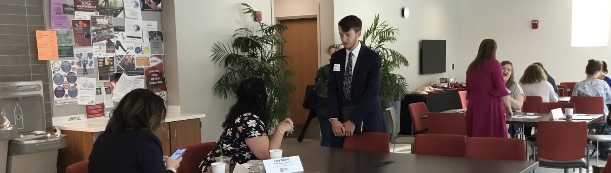

[The 2 Hour Job Search](#the-2-hour-job-search) &nbsp; &nbsp;
[Organizational Research Guide](#organizational-research-guide) &nbsp; &nbsp;
[How to Apply for a Federal Job](#how-to-apply-for-a-federal-job) &nbsp; &nbsp;
[State and Local Government Job Search](#state-and-local-government-job-search) &nbsp; &nbsp;
[Maximize Your Job Search Productivity](#maximize-your-job-search-productivity) &nbsp; &nbsp;

---

## The 2 Hour Job Search

 &nbsp; &nbsp; 
 
The 2-hour job search guide will help you identify organizations, roles, and individuals to start a discussion about your future career choices. Download the guide and get started today!
 


---
---
## Organizational Research Guide

The experts at the Business/O’Neill Information Commons can help you with your research through the Hire Ed program. Visit their website to schedule your consultation and access research and compensation guides to assist you in your individual research. 

__Organization Name:__

__Industry__ 
1. What is the line of business of organizations in this industry? (Do they provide a service, create, distribute a product, etc.) 
_How do they make money to support their organization, are they supported by grants? 
Resources you might use: Vault Guide, Informational Interviews_       

2. What are the significant trends in this industry?   
_Resources you might use: Informational Interviews, Vault, Professional Association website, Professional Journals_

3. Who are the major organizations (key players) in this industry?   
_Resources you might use: Vault, Glassdoor, Professional Association websites_ 

4. What are the key professional associations and journals for the industry?   
_Resources you might use: Vault, Google_

__Organization__ 
1. Organization Type (public, private, nonprofit)   
_Resources you might use: Organization website, LinkedIn_
 
2. Product/Services Offered (Complete current product/service line and potential new products/services)   
_Resources you might use: Organization website_

3. Organization size, parent company (if any), subsidiaries (if any), location of headquarters, geographic   presence 
_Resources you might use: Organization website_

4. Organization’s competitors (other major players in the industry)   
_Resources you might use: Vault, Glassdoor_

5. Mission/Vision/Organization direction within the past year and future plans   
_Resources you might use: Organization website, Professional Journals, Press Releases_

6. Key People (CEO, VP, Pres.), SPEA/IU Alums   
_Resources you might use: Organization website, LinkedIn; Google key people, read interviews/articles, watch videos_  

7. Annual Report (annual gross, ranking, stock price)   
_Resources you might use: Organization website, Annualreports.com_

8. What are the “buzz words” in the organization?   
_Resources you might use: Informational Interviews, Organization website_ 

9. What is the “culture” of the organization? (Is it conservative, liberal, relaxed, etc) How diverse is the team?  
_Resources you might use: Informational Interviews, Organization website, Glassdoor_

10. How has the organization been in the news in the last year? How does it interact with the community?  
_Resources you might use: LinkedIn, Google_

__Function (position applying to)__
1. What department/division is the position housed? Who does it report to?   
_Resources you might use: Organization website, LinkedIn_

2. What is the career path for this position?  
_Resources you might use: Organization website, LinkedIn_

3. What are the skills and personal qualities that successful professionals in this industry share?   
_Resources you might use: Informational Interviews, LinkedIn, Glassdoor, Vault_ 

4. What additional education/licensure/certifications will you need to be promoted in this area?  
_Resources you might use: Informational Interviews, LinkedIn, Glassdoor, Vault_ 

[Back to top](#nav)

---
---
## How to Apply for a Federal Job

The federal job search process varies considerably from private and non-profit searches. The time-to-hire for federal positions can be anywhere from 6 – 18 months depending on the position and the degree of security clearance required.  

If you have already developed your STAR stories, qualified and quantified your accomplishments, and can show value-add to employers for your 1 – 2 page resume, you have a great start for your federal resume. In addition, you will need to add: start and end dates (month and year), the number of hours you worked each week, the level and amount of experience (project manager vs team member) to demonstrate your responsibilities. You will also need to tailor your accomplishment statements to address every required qualification in the job vacancy. Because of the required details, it is not uncommon for a federal resume to be 4 – 6 pages long.  

Work with the team in the Career Studio when you develop your federal resume. Also attend labs hosted by the Policy, Service, and Advocacy Career Community. There are opportunities to learn more about the federal resume and job search from alumni and employer partners who guest host sessions in the Hub.  

__Getting Started on USAJOBS__

1. Create your USAJOBS account (applicants MUST apply through USAJOBS).  

-	Create your USAJOBS account (USAJOBS.gov). You must have a complete, accurate, and thorough profile to apply to any job on USAJOBS.  
Use these resources to help you develop your federal resume:  
-	USAJOBS What to Include on My Federal Resume  
-	Writing Your Federal Resume   

After your profile is set up, you will be able to: 
-	Save jobs to apply to later.  
-	Create automated job searches.  
-	Use the USAJOBS resume builder to create your federal resume.   
-	Upload and save required documents.  
-	Apply to job announcements.  
-	Track your application status.  

Look at USAJOBS every day so you do not miss opportunities.  

2. Search for jobs.  
-	Search by keywords, location, pay grade, salary, job series, agency, and more.  
-	Carefully review the announcement to see if you are eligible and meet all the qualifications. Read the “Who May Apply” section to determine whether you are eligible to apply for the job.   

3. Sign up for daily emails to receive updates on your automated job searches.  
Some jobs may only accept applications for a few days, so you need to check the site daily to see if there are any new opportunities for you. 

4. Apply immediately.  
-	Apply immediately when you find a position that you are qualified for. Allow yourself at least an hour to complete your application.  
-	After you submit your application, verify that your application has been received by the agency. The application status field should display “received” if the application submitted correctly.  

5. Check to see if you have been "referred."  
-	Applicants typically will then be placed into qualification categories: Qualified, Highly qualified, Best qualified. (These quality categories can be thought of as bronze, silver, and gold.)   
-	The highest qualified applicants will be sent to the hiring official, and those applicants may see their application status updated to "referred." Applicants not being considered further will see a “not referred” status.  

[Back to top](#nav)

---
---
## State and Local Government Job Search  
Many choose to work at the state and local levels because they feel like they see an immediate impact of their efforts on the lives of people in their community. Each state has its own central website for job postings in all the state agencies. If you know where you want to live after you graduate, find that state’s website and create an application that you can modify for each position you apply to.  

Local government positions are posted on the official municipality’s website. Review the website for the area you’re interested in and gather the information required for applications. When a position you are interested in becomes available, apply as soon as you can.  

__Use the following resources as you begin and manage your search:__ 

* State by State Search State & Local Government provides personnel websites for all 50 states. You can sort by department, skills, agency, etc.  

* Municipal League Websites Each state (except Hawaii) has a league that cities and towns can join. The advantage in using the league’s website is that you will see opportunities throughout the state, not just in one city. Visit the National League of Cities website to find the state or states you are interested in.  

* Professional Association Websites Recruiters post with professional associations when they are searching for a specific skill set. You can begin your search for public sector professional associations with this list.   

* The International City-County Management Association (ICMA) ICMA provides listings of fellowships and internships by state. It has local government management fellowships for graduate students and an undergraduate internship program where students can learn about local government in a specific host city.  

* Emerging Local Government Leaders (ELGL) This organization lists jobs for cities and counties across the nation. It also provides a great way to connect with other leaders and build your network. Visit the site regularly to keep up-to-date on offerings.  

* Network of Schools of Public Policy, Affairs, and Administration (NASPAA) This website provides a job board and a listing of state and local internship and fellowship programs.   

* PublicServiceCareers.org You will great advice for your internship and job search as well as information about continued education and training to consider.   

* State and Local Associations You can find postings on the National League of Cities, National Urban League, and the National Association of Counties websites.   

[Back to top](#nav)

---
---
## Maximize Your Job Search Productivity

It can be difficult to stay productive during the job search – especially when the stress of keeping up with your classes feels like more than a full-time job already. Your graduate program will go by quickly, you must develop a plan to capitalize on the time you have to devote to your search.

__Develop a Schedule__  
⬜️ Analyze your daily schedule and block out times to devote to the job search. Even as little as 30 minutes before breakfast will keep you moving forward in the process.  

#### Designate time for each of the following:
⬜️ Reaching out to new networking contacts, following up with your existing contacts  
⬜️ Researching new organizations, finding contacts  
⬜️ Writing cover letters and tailoring resumes  
⬜️ Submitting applications  
⬜️ Checking the status of submitted applications  
⬜️ Updating LinkedIn  
⬜️ Set weekly goals for organizations to research, applications to submit, contacts to reach out to, etc.
⬜️ Consider assigning activities to days of the week to stay efficient. For example: Monday – Searching for organizations; Tuesday – Researching organizations on your list; Wednesday – Tailor your resumes and cover letters for positions you will apply to; Thursday – Submit applications; Friday – Reach out to new and existing network contacts   

#### Stay Organized
⬜️ Update your Professional Development Tracking Form to monitor your progress, track communications, and organize your outreach.    
⬜️ Keep files of the resume and cover letter you used for each organization you applied to. You will be able to easily review them when you prepare to interview so you will know exactly what the hiring committee has looked at.  
#### Use LinkedIn 
⬜️ Ask for recommendations from previous bosses/coaches/supervisors, coworkers, classmates who served on group projects with you, etc.  
⬜️ Conduct detailed searches to find organizations you are interested in and people you would like to talk to.  
⬜️ Keep your profile updated with latest skills, projects, images, writing samples, presentations, etc. so your profile shows up at the top of searches.    
⬜️ Post regular updates, join groups, and comment on industry-related topics and articles.  

[Back to top](#nav)

---
---

