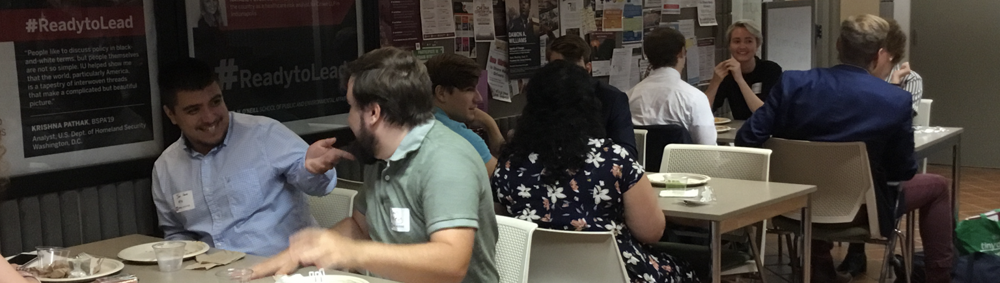

---
[Resumes](#resumes) &nbsp; &nbsp;
[Accomplishment (STAR) Stories](#accomplishment-star-stories) &nbsp; &nbsp;
[Writing High Impact Resumes](#writing-high-impact-resumes) &nbsp; &nbsp;
[Resume Action Verbs](#resume-action-verbs) &nbsp; &nbsp;
[High-Impact Cover Letters Overview](#high-impact-cover-letters-overview) &nbsp; &nbsp;
[High-Impact Cover Letters Practice](#high-impact-cover-letters-practice) &nbsp; &nbsp;

---
## Resumes
  &nbsp; &nbsp;  
 
__General Resumes__
Your resume is your personal marketing piece that provides an overview of your education, experiences, and skills to potential employers. There are several types of resumes the Career Hub team will refer to:  

This document is a compilation of all your work, volunteer, campus, and academic experiences. It is usually divided into two different general sections – “Experience” and “Activities.” Your general resume should never be used as an application for a position; it is instead a repository that you will pull from to develop your tailored resumes.  

__Tailored Resume:__  You will tailor your general resume for every position you apply to. Deconstruct the job posting, and then incorporate keywords and language into your accomplishment statements. Write your statements to highlight the accomplishments the employer is looking for in the job posting.  

__Industry Resume:__ As you create tailored resumes for positions, you should update your general resume with the language employers in that field use. For example, if you are considering both sustainability work and social service roles, you should develop a resume with your accomplishments written to reflect competencies sustainability employers seek, and one that reflects social services competencies. When you apply to future positions, you can more easily tailor from an already focused document.  

__Federal Resume:__ Federal resumes are unique and are addressed in a separate section.  

A curriculum vitae or CV is a very comprehensive document used to apply to academic and research positions. It includes all teaching positions and/or research positions, publications, presentations, etc. It is not used very often at the undergraduate level but may be used at the graduate level if the student is applying for grants, scholarships, and research opportunities.

### Formatting Checklist

⬜️	Length: 1 page for undergraduates; 2 pages for graduate students  
⬜️ Font Size: 10 – 12-point font for the body of your resume; 14 – 24 font for your name (your name should be the largest font on your resume)  
⬜️ Fonts: Use fonts that are easy-to-read on screens and in print. Some common choices include: Calibri, Cambria, Garamond, Georgia, and Helvetica.   
⬜️	Margins: Keep margins to .5 – 1”  
⬜️ Spacing: Double-space between sections, single-space within sections  
⬜️ Alignment: Use left alignment; right-justify the dates; section headings can be centered  
⬜️ Format Experiences: Bold the organization’s name, italicize your job title  
⬜️ Accomplishment Statements: Have a goal of 2 – 5 statements for each experience you include  
⬜️ Numbers: Use numerals for all numbers – they catch the eye of the person scanning your document. (5 not five; 50% not fifty percent)   
⬜️ Order: In each section, list your most recent experience first (this is called reverse chronological order)  
⬜️ Language: Do not use complete sentences or include personal pronouns (I, we, my, our, etc)  

### Develop Your Resume
Regardless of where you are in your academic career, you have experiences to include on a resume! Complete the following exercise to help brainstorm experiences to include on your resume. Work in the Career Studio to get some assistance.

1.	List every experience you have had, include: part-time jobs, volunteer positions, student organizations, athletics, etc. List the organization and the title you held. Example: The Longhorn Grill, server  
2.	Consider your responsibilities on an average day, and list 3 – 5 action verbs from the list included in this book for each that show the skills you used.  
3.	For each verb, ask yourself what you did and how you did it.  
Example: coordinated dinner service; trained 6 new hires  
4.	Think about the impact you made for the organization or the customer – the “so what” of what you did. Include those results in your statements. Use numbers anywhere you can to communicate the scope of your work.  

Your accomplishment statements should be 1 – 3 lines long. It’s hard to communicate impact in only 1 line, and employers aren’t interested in a task list.  They want to know what you accomplished.  

_Example: Coordinated dinner service for restaurant that served up to 500 customers/night with 5 other servers; Trained 6 new hires in policies and procedures and customer-service strategies; all 6 successfully completed training and began working independently in 2 weeks_ 

[Back to top](#nav)

### Organize Your Resume

Now that you have a list of your experiences with some accomplishment statements, you can begin organizing your resume in the following categories.   

#### Heading (Contact Information)
This includes your full name, permanent and/or school address, Indiana University email, phone number for a phone you answer (be sure your voicemail is a professional-sounding message), personal LinkedIn URL. You will use this heading for your cover letters, references sheet, thank you letters, and any other written correspondence.   

#### Education
Indiana University will be the first school listed. Include school name (The O’Neill School for Public and Environmental Affairs), location, degree (spell out completely), graduation date (month and year – do not include “anticipated”), GPA, major(s), and minor(s). You may include coursework and any honors. Freshman can include high school information, but that should go away by sophomore year.   

#### Experience
For your general resume, this section includes any work you were paid to do. Include organization name, location, your title, the dates you were employed (month and year only, you do not need to include the day). Each position you list should have 2 – 5 accomplishment statements. When you create tailored resumes, you will create section headings that will market specific competencies you wish to highlight. For example, “Research Experience,” “Project Management Experience,” “Human Resources Experience,” etc.   

#### Activities
This section is formatted just like the Experience section but includes volunteer work and positions you were not paid to do (for example, leading a student organization). When you create your tailored resume, these positions will be combined with your paid experiences to provide a full view of your demonstrated experience with a specific competency. For example, you can manage a budget for a student organization and help manage a budget in a part-time job. Both of those experiences can show an employer your level of performance and accomplishment with that skill.   

#### Interests
This section is completely optional. The purpose of this section is to provide a more well-rounded view of yourself to an employer. If you choose to include it, don’t provide generic information. Many students will include things like: hiking, reading, basketball. That doesn’t provide much for the employer to ask you about. Instead, consider something like: Hiking the Appalachian Trail (through-hike summer 2019), science fiction novels, Hoosier basketball.    

#### Saving Your Document
Always save your resume as a pdf file with your first and last name in the file name. If you submit a Word document to an employer, there is a good chance it will be distorted when they open it on their computer.   

[Back to top](#nav)

---
---

## Accomplishment STAR Stories
Brainstorm accomplishments from your academic and professional experiences. Use this document to organize your experiences. 

### 

[Back to top](#nav)

---
---
## Writing High Impact Resumes

You must tailor your resume for each employer and position you apply to. Take the accomplishment STAR stories you created, and incorporate language from the job posting where you can. By using the employer’s own language, you will help them see you as “the candidate” for their open position.  

__How to Deconstruct a Job Description__   
An important part of the internship/job search process is being able to interpret the description. The best way to fully understand a position description is to take several minutes to deconstruct and analyze it.

__Step 1: Position Title__  
•	The position title can sometimes give you a sense of what the internship/job will entail. For example: Software Engineer, Social Media Coordinator, or Health Educator.  
•	If the title is ambiguous or unclear, do some further investigating to get a better idea of the position. You do not want to judge or be discouraged by a position solely on its title.  

__Step 2: Responsibilities/Duties__  
•	These include the daily functions and projects associated with the position. For example: coordinate monthly meetings, analyze laboratory samples, or provide operational support of databases.  
•	Carefully read over the responsibilities of the position and highlight/circle the important details.  

__Step 3: Skills and Abilities__  
•	These often refer to the skill set an employer is looking for in an ideal candidate. For example: the ability to work both independently and with a team, excellent written and communication skills, or being detail-oriented.  
•	Think about your past work experiences, as well as class projects, clubs and organizations you belong to, and any volunteer experience you may have. It is likely you have gained applicable skills through your experiences that align with the position.  

__Step 4: Qualifications__  
•	Qualifications usually include the specific educational requirements (e.g., Bachelor’s Degree, Master’s Degree) and the number of years of experience in the related field (e.g., one to three years of marketing experience, knowledge in a classroom setting). Specific licenses and courses can also be included in the qualifications section.  
•	Pay close attention to the first few qualifications listed in the description. Employers often list the most important first.  

__Step 5: Analyzing the Internship/Job Description__  
•	Now that you have carefully reviewed the position description, think about how your experiences and education match up.  
•	On sheet of paper, make two columns. In one column, list the position’s responsibilities, skills, and qualifications. In the other column, detail how you meet each of the three components. Keep in mind that not all positions will have the same sections.  
•	Do not panic if you do not have experience in every area. Remember years of experience can include internships, academic work, etc. If you meet at least 75% of what the employer is looking for, you are a competitive candidate!  

[Back to top](#nav)

## Writing Your Resume

The trick to writing a high impact resume is using the employer’s own language so that they see their needs reflected in what you have already accomplished. Never, ever lie about what you have accomplished; you are simply exchanging your words for the employer’s language on your resume where it fits. If you don’t, you will be submitting a generic resume (one that you could send to any employer) instead of a high impact one.  

__High Impact Accomplishment Statements__  
Resume statements need to explain the “so what” of your work for the employer – why is what you listed important for them to know? To answer the “so what”, take your accomplishment STAR stories and rewrite them into accomplishment statements with the following formula:
__ACTION + SITUATION/TASK + RESULT__  

1.	For each accomplishment statement, replace the “ACTION” with an action verb from the job posting.  
2.	Use at least 1 keyword from the job posting in the SITUATION/TASK portion of the statement.  
3.	End with a strong, verifiable result that is relevant to the position/organization. Verifiable results are achievement-oriented, contain numbers whenever you can provide them, and demonstrate impact.  

__Job Posting Example:__  
_Contribute to the articulation of product and technical strategy to key business partners during product development and requirement sessions. Work effectively across business areas by building and leveraging strong relationships. Identify and mobilize cross-functional support required to achieve business objectives, including areas of tactical and strategic support. Create and manage detailed project plans to track product development and commercialization. Manage multiple competing products/projects with effective prioritization and eye for detail. Product management responsibilities may include management of exception process, execution of product refreshes or product compliance, updating and review of marketing materials, fielding of product questions, pulling of product data, and being SMEs on product support systems and flows. Take full accountability for end result, serve as product expert, and leverage all resources available to achieve objectives._

__Original Statements:__
•	Interfaced with other departments to ensure proper data collection, information dissemination, and financial management activities  
•	Develop and implement quarterly and annual strategic plans that support business plans  

__High Impact Statements__  
•	Mobilized cross-functional teams to ensure tactical and strategic support of business objectives were met; achieved 28% increase in patient satisfaction scores  
•	Articulated quarterly and annual project strategy to key business partners, successfully converting strategy into implementation plans; notably improved quality and productivity through detailed project plans and training, prioritized goal setting, and incentives as project SME  

## High-Impact Resume Preparation Worksheet

### 

---
---
## Resume Action Verbs

### 

[Back to top](#nav)

---
---
## High Impact Cover Letters Overview

Write a tailored cover letter for each and every opportunity you apply to – whether one is required or not. Not only is it a great exercise for you to articulate how you are relevant to the position and organization, but it is not uncommon for hiring committees to go back to the cover letters when they are trying to make decision between their final two candidates. The effort you put into demonstrating your mission alignment, what you can accomplish for them, and the impact you can make together will serve you well throughout the hiring process.
Each letter must be tailored to the position and align with the organization’s culture and requirements for the role. Use the organization’s language by incorporating key words and expressions you identified when you deconstructed the job posting and in your research.  

Visit the Career Studio for assistance developing your letter. Always get feedback on your letter and tailored resume before you send it.  

Keep your cover letter to 1 page, using a left-justified, business letter format.   

__Include the following sections:__

#### Heading
Use your resume header so that your materials are branded. Put the date underneath the header.

#### Employer’s Address
Include the name, title, organization and address of the person you’re writing.

#### Salutation/Greeting
Always address your letter to a specific person. Ask your contact inside the organization who would be appropriate or use LinkedIn searches or the organization website to find a proper name. If you absolutely cannot find a name, use “Dear Hiring Committee” or “Dear Hiring Manager” – do not use “To whom it may concern.”

#### Introductory Paragraph (1st paragraph)
Use this paragraph to introduce yourself and state the position you are applying for, and why this position/organization is exciting to you. Immediately show the readers your mission alignment to grab their attention and encourage them to continue reading. Include the name of your contact inside the organization here or mention the name of the recruiter you spoke with on campus.

#### Body Paragraphs (2nd and 3rd paragraphs)
This section is all about what you can do for them – DO NOT TELL THEM HOW THE POSITION WOULD BE GREAT FOR YOU. They know that, and the same is true for every applicant. Your focus is on how you can help them with their pain points (the problems the person in this position will manage).   
•	Describe what you offer the employer in terms of experience, past accomplishments, and work you’ve already done that aligns you with their mission.  
•	Provide specific examples of how you when you’ve demonstrated the skills the position requires.  
•	Identify common ground between you and the employer – values and traits that you both share.  
•	Show your research by incorporating one of their current projects, a recent news article about them, any developments or trends in the industry, etc. in your letter.  
•	Even though this is a formal letter, you can use bullet points, bolding, or indentation to make your points easier for the readers to scan.  
•	Consider using the 2nd paragraph to demonstrate your fit with the functional role (the position) and the 3rd paragraph to show your fit with the organization.  

#### Final Paragraph (Closing)
Thank the employer for their consideration of your application. Restate your interest in the organization and position, remind them of how you are mission-aligned, and state how you would be able to help them make a greater impact toward that mission. Request an opportunity to discuss the position in an interview (Example: I hope to further discuss the contributions I would make to your team in an interview). If the organization isn’t in your immediate area, let them know if you have upcoming plans to visit the area.  

[Back to top](#nav)

---
---
## High Impact Cover Letters Practice

### 

[Back to top](#nav)

